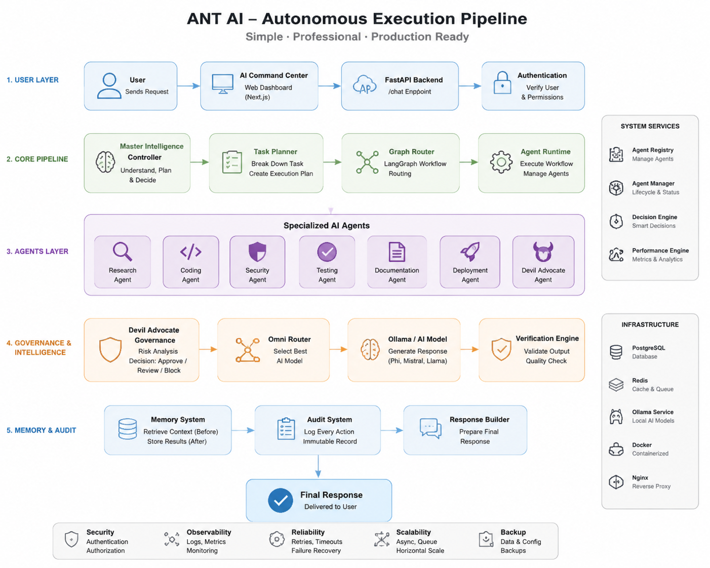

# ANT-AI Architecture

ANT is a modular AI agent platform.

## Autonomous Execution Pipeline

## Core Layers

- Agent Swarm
- Memory OS
- Knowledge Engine
- Connector System
- Simulation Lab
- Security Fortress
- Upgrade Manager
- Android Runtime
- APK Factory

## Development Principle

Discover -> Analyze -> Test -> Validate -> Integrate
